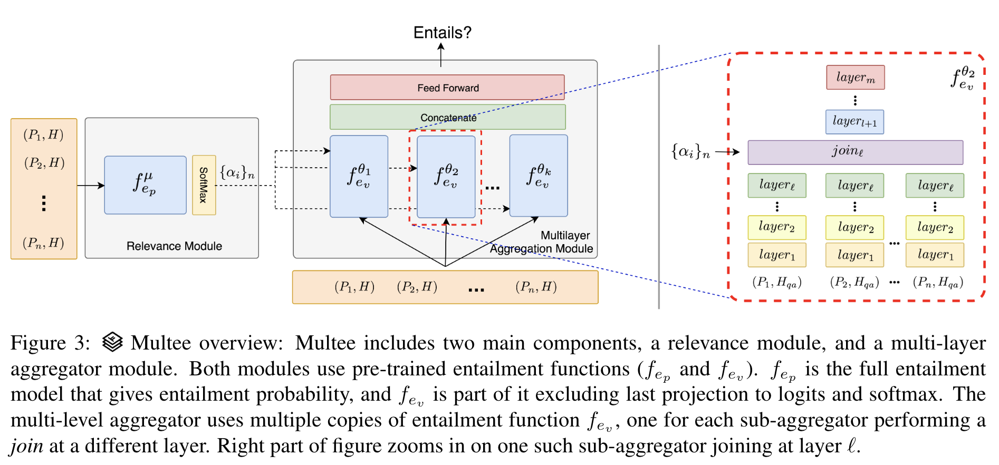

# <p align=center>`Multee` </p> 

## <p align=center>Repurposing Entailment for Multi-Hop Question Answering Tasks</p>



This is the code for Multee model described in our NAACL 2019 paper: ["Repurposing Entailment for Multi-Hop Question Answering Tasks"](http://ai2-website.s3.amazonaws.com/publications/Multee-NAACL2019.pdf). It is build on [PyTorch](https://pytorch.org/) and [AllenNLP](https://allennlp.org/).


## Setup

### 1. Download the data for SNLI, MultiNLI, OpenBookQA and MultiRC

```bash
bash scripts/setup_data.sh
```

### 2. Rank OpenBookQA knowledge sources

We use OpenBookQA's code directly for this purpose.

```bash

# Clone OpenBookQA's repository
git clone https://github.com/allenai/OpenBookQA

# Copy script to rank knowledge into the repository
cp preprocessing/rank_openbookqa_knowledge_sources.sh OpenBookQA/

# Setup OpenBookQA dependencies temporarily because we used their retrieval.
cd OpenBookQA
conda create -n obqa python=3.6
source activate obqa
bash scripts/install_requirements.sh

# Rank/Retrieve from knowledge sources (This would take time.)
bash rank_openbookqa_knowledge_sources.sh

# reset back
source deactivate

# Get back to the root repository
cd ..
```

### 3. Install Multee requirements

```bash
conda create -n multee python=3.6
bash scripts/install_requirements.sh
```

### 4. Run preprocessing for all datasets

```bash
bash preprocessing/combine_snli_multinli.sh
python preprocessing/preprocess_openbookqa.py
python preprocessing/preprocess_multirc.py
```


### 5. Download trained models

```bash
bash scripts/download_trained_models.sh
```


## Use Pre-trained models

### OpenBookQA

To make predictions with trained Multee model on OpenBookQA

```bash
# Make predictions on MultiRC test dataset

python run.py predict-with-vocab-extension trained_models/final_multee_glove_openbookqa.tar.gz \
                                          data/preprocessed/openbookqa/openbookqa-test-processed-questions.jsonl \
                                          --predictor multiple_correct_mcq_entailment \
                                          --output-file predictions/openbookqa-test-predictions.jsonl \
                                          --batch-size 10 \
                                          --embedding-sources-mapping  '{"_text_field_embedder.token_embedder_tokens": "https://s3-us-west-2.amazonaws.com/allennlp/datasets/glove/glove.840B.300d.txt.gz"}' \

# Convert OpenBookQA predictions to official format.

python evaluation_scripts/openbookqa_predictions_to_official_format.py serialization_dir/multee_glove_openbookqa/openbookqa-test-processed-questions-predictions.jsonl serialization_dir/multee_glove_openbookqa/openbookqa-test-processed-questions-official-predictions.jsonl


python evaluation_scripts/evaluate_openbookqa_predictions.py data/raw/openbookqa_1.0/openbookqa_1.0_dev.json serialization_dir/multee_glove_openbookqa/openbookqa-test-processed-questions-official-predictions.jsonl
```

To directly evaluate with trained Multee model on OpenBookQA

```bash
python run.py evaluate trained_models/final_multee_glove_openbookqa.tar.gz \
                                      data/preprocessed/openbookqa/openbookqa-test-processed-questions.jsonl \
                                      --extend-vocab \
                                      --embedding-sources-mapping  '{"_text_field_embedder.token_embedder_tokens": "https://s3-us-west-2.amazonaws.com/allennlp/datasets/glove/glove.840B.300d.txt.gz"}' \
```


### MultiRC

To make predictions with trained Multee model on MultiRC

```bash
# Make predictions on MultiRC dev dataset

python run.py predict-with-vocab-extension trained_models/final_multee_glove_multirc.tar.gz \
                                          data/preprocessed/multirc/multirc-dev-processed-questions.jsonl \
                                          --predictor multiple_correct_mcq_entailment \
                                          --output-file predictions/multirc-dev-predictions.jsonl \
                                          --batch-size 10  \
                                          --embedding-sources-mapping  '{"_text_field_embedder.token_embedder_tokens": "https://s3-us-west-2.amazonaws.com/allennlp/datasets/glove/glove.840B.300d.txt.gz"}' \

# Convert MultiRC predictions to official format.

python evaluation_scripts/multirc_predictions_to_official_format.py serialization_dir/multee_glove_multirc/multirc-dev-processed-questions-predictions.jsonl serialization_dir/multee_glove_multirc/multirc-dev-processed-questions-official-predictions.jsonl


python evaluation_scripts/evaluate_multirc_predictions.py data/raw/multirc_1.0/multirc_1.0_dev.json serialization_dir/multee_glove_multirc/multirc-dev-processed-questions-official-predictions.jsonl
```

To directly evaluate with trained Multee model on MultiRC

```
python run.py evaluate trained_models/final_multee_glove_multirc.tar.gz \
                                      data/preprocessed/multirc/multirc-dev-processed-questions.jsonl \
                                      --extend-vocab \
                                      --embedding-sources-mapping  '{"_text_field_embedder.token_embedder_tokens": "https://s3-us-west-2.amazonaws.com/allennlp/datasets/glove/glove.840B.300d.txt.gz"}' \
```

Minor Note: You won't need to pass `--embedding-sources-mapping` in `evaluate` and `predict-with-vocab-expansion` commands after [this](https://github.com/allenai/allennlp/pull/2899) PR is merged in allennlp.


## Retrain Models

Multee takes a pretrained entailment model. So to re-train full Multee you would first need to retrain the underlying entailment model and then retrain Multee. 

### For OpenBookQA,

```bash
# Step 1: Retrain ESIM model in NLI datasets
python run.py train experiment_configs/final_esim_glove_snli_multinli_for_openbookqa.json serialization_dir/final_esim_glove_snli_multinli_for_openbookqa

# Step 2: Retrain Multee on OpenBookQA
python run.py train experiment_configs/final_multee_glove_openbookqa.json serialization_dir/final_multee_glove_multirc

```


### For MultiRC,

```bash
# Step 1: Retrain ESIM model in NLI datasets
python run.py train experiment_configs/final_esim_glove_snli_multinli_for_multirc.json serialization_dir/final_esim_glove_snli_multinli_for_multirc

# Step 2: Retrain Multee on OpenBookQA
python run.py train experiment_configs/final_multee_glove_multirc.json serialization_dir/final_multee_glove_multirc

```

## Citing

If you use this code, please cite our [paper](http://ai2-website.s3.amazonaws.com/publications/Multee-NAACL2019.pdf).

```
@article{trivedi2019repurposing,
  title={Repurposing Entailment for Multi-Hop Question Answering Tasks},
  author={Trivedi, Harsh and Kwon, Heeyoung and Khot, Tushar and Sabharwal, Ashish and Balasubramanian, Niranjan},
  journal={arXiv preprint arXiv:1904.09380},
  year={2019}
}
```

... and also AllenNLP.

```
@inproceedings{Gardner2017AllenNLP,
  title={AllenNLP: A Deep Semantic Natural Language Processing Platform},
  author={Matt Gardner and Joel Grus and Mark Neumann and Oyvind Tafjord
    and Pradeep Dasigi and Nelson F. Liu and Matthew Peters and
    Michael Schmitz and Luke S. Zettlemoyer},
  year={2017},
  Eprint = {arXiv:1803.07640},
}

```
